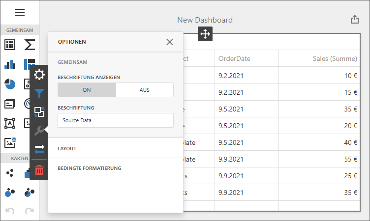

<!-- default badges list -->

[](https://supportcenter.devexpress.com/ticket/details/T972359)
[](https://docs.devexpress.com/GeneralInformation/403183)
<!-- default badges end -->
# Dashboard for Vue - Localization

The example shows how to localize the Dashboard component in a Vue application:

- Translate UI element captions to a different language: dialog boxes, buttons, menu items, error messages, etc.
- Format numbers, dates, and currencies according to specific culture settings.



## Example Structure

The example has the following structure:

- The [asp-net-core-server](asp-net-core-server) folder contains the backend project built with ASP.NET Core 3.1.
- The [dashboard-vue-app](dashboard-vue-app) folder contains the client application built with Vue.

### Client Localization
*Files to Review*:

* [App.vue](./dashboard-vue-app/src/App.vue)

The **dashboard-vue-app** project shows how to localize a client application with the [component-specific JSON files](https://docs.devexpress.com/Dashboard/402537/web-dashboard/dashboard-component-for-vue/localization#localize-ui) for the German market (the `de` culture). Intl is used to format to dates, numbers, and currencies.

### Server Localization

*Files to Review*:

* [Startup.cs](./asp-net-core-server/Startup.cs#L45)

Since the Web Dashboard exports data on the server side, you need to localize the server to complete the localization process. The **asp-net-core-server** project contains satellite resource assemblies for the German culture.


## Quick Start

### Server

In the **asp-net-core-server** folder run the following command:

```
dotnet run
```

The server starts at `http://localhost:5000` and the client gets data from `http://localhost:5000/api/dashboard`. To debug the server, run the **asp-net-core-server** application in Visual Studio and change the client's `endpoint` property according to the listening port: `https://localhost:44393/api/dashboard`.

See the following section for information on how to install NuGet packages from the DevExpress NuGet feed: [Install DevExpress Controls Using NuGet Packages](https://docs.devexpress.com/GeneralInformation/115912/installation/install-devexpress-controls-using-nuget-packages).

> This server allows CORS requests from _all_ origins with _any_ scheme (http or https). This default configuration is insecure: any website can make cross-origin requests to the app. We recommend that you specify the client application's URL to prohibit other clients from accessing sensitive information stored on the server. Learn more: [Cross-Origin Resource Sharing (CORS)](https://docs.devexpress.com/Dashboard/400709)

### Client

In the **dashboard-vue-app** folder, run the following commands:

```
npm install
npm run serve
```

Open ```http://localhost:8080/``` in your browser to see the result.

## Documentation

- [Localize Dashboard Component for Vue](https://docs.devexpress.com/Dashboard/402537/web-dashboard/dashboard-component-for-vue/localization)
- [Install DevExpress Controls Using NuGet Packages](https://docs.devexpress.com/GeneralInformation/115912/installation/install-devexpress-controls-using-nuget-packages)

## More Examples

- [Dashboard for Angular - Localization](https://github.com/DevExpress-Examples/angular-dashboard-localization)
- [Dashboard for React - Localization](https://github.com/DevExpress-Examples/react-dashboard-localization)
- [Dashboard Control for JavaScript Applications - Localization](https://github.com/DevExpress-Examples/javascript-dashboard-localization)

- [ASP.NET Core Dashboard Control - Localization](https://github.com/DevExpress-Examples/asp-net-core-dashboard-localization)
- [ASP.NET MVC Dashboard Extension- Localization](https://github.com/DevExpress-Examples/asp-net-mvc-dashboard-localization)
- [ASP.NET Web Forms Dashboard Control - Localization](https://github.com/DevExpress-Examples/asp-net-web-forms-dashboard-localization)
